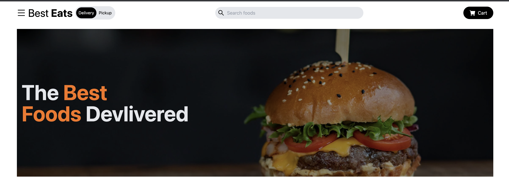
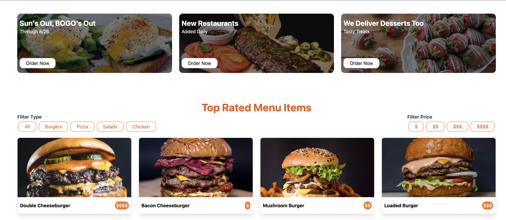
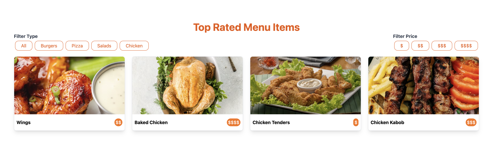
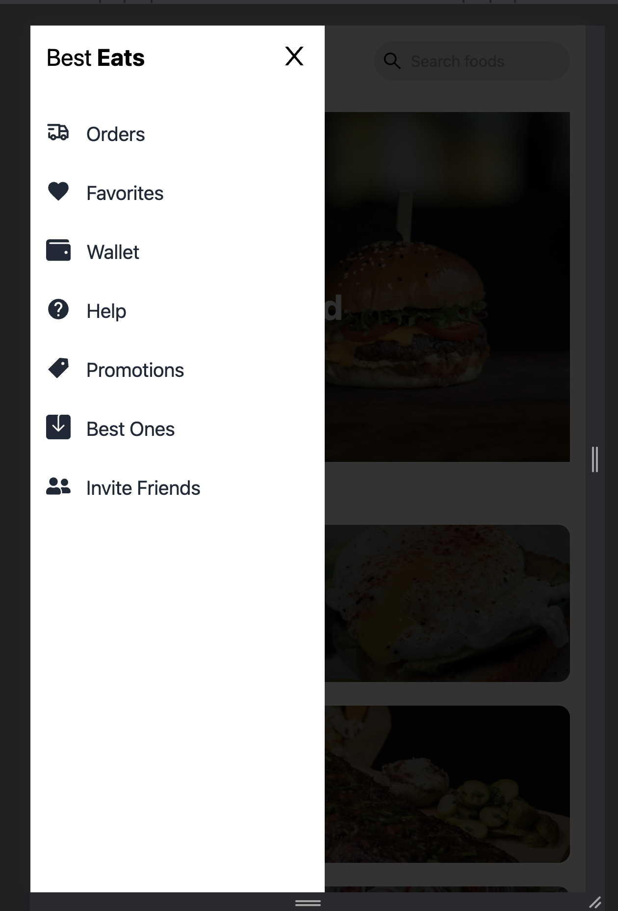
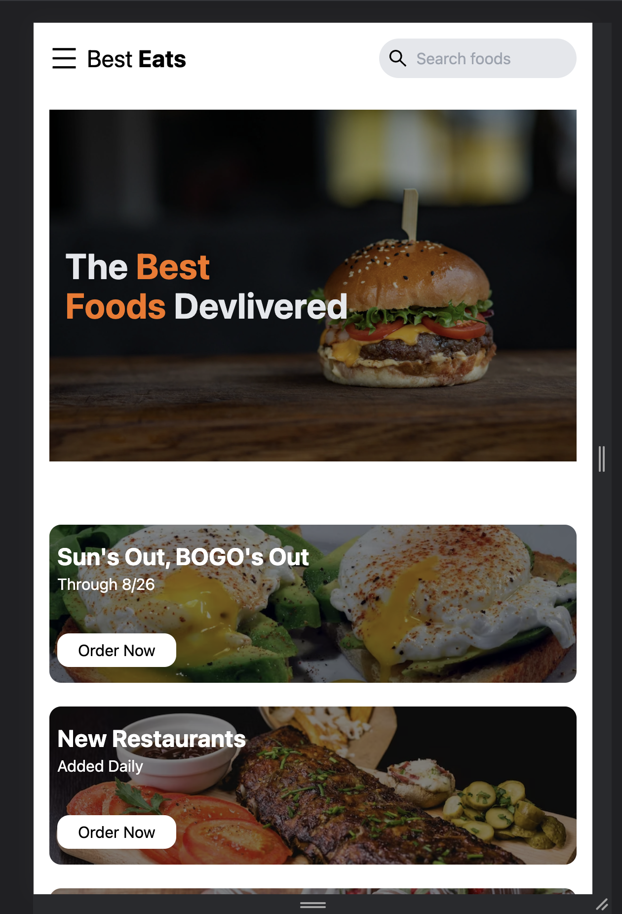
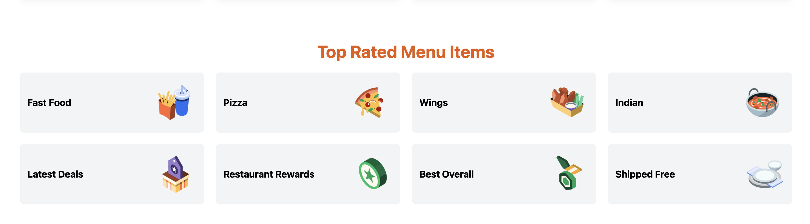
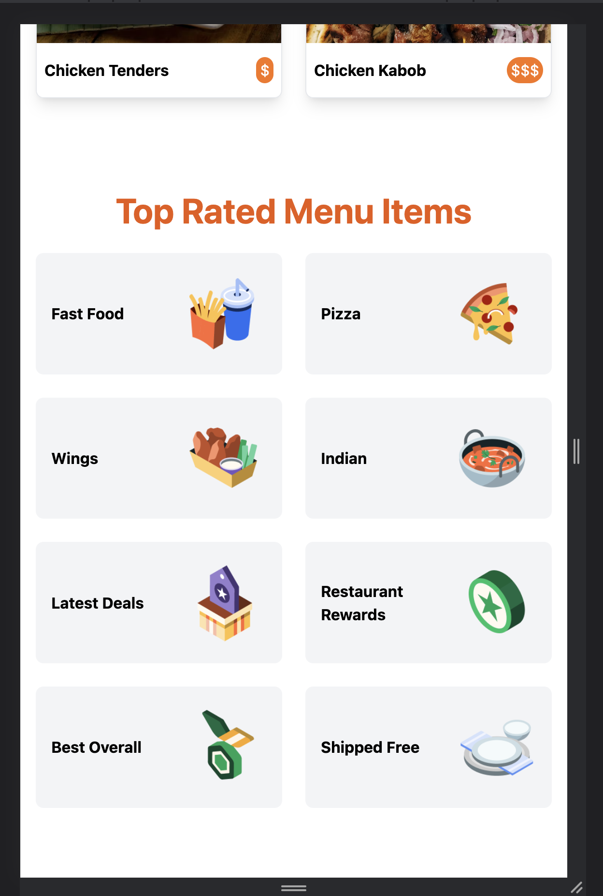

# React Website Tutorial With Tailwind CSS - Beginner React Mobile Responsive Project

React Website With Tailwind CSS - Beginner React Mobile Responsive Project. 
Follow along and build this beginner friendly React JS website styled completely with Tailwind CSS. 
Mobile first responsive design approach using flexbox and grid layouts. 
Pulling all of the data/images from the data.js file to simulate an API response. 
Filter through data/images using the javascript filter array method.

# Goals

🏆 Build a React JS website - Beginner Guide
🏆 Tailwind CSS
🏆 useState Hook
🏆 Filter results

⏰ Timestamps

 Welcome
 Create React App
 Install Tailwind CSS
 Global Styles in Index.css
 Navbar component
 Mobile Menu
 Hero Component
 HeadlineCards Component
 Food Component
 Map through data
 Filter through data
 Category Component

💻 Screen shot   💻

🌏 ![demo] :(https://taupe-cannoli-8e51e6.netlify.app/)